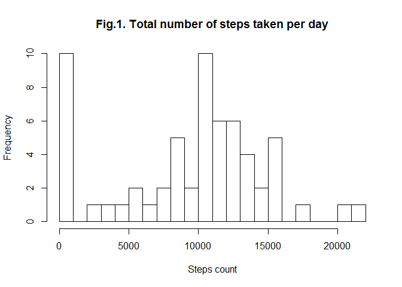
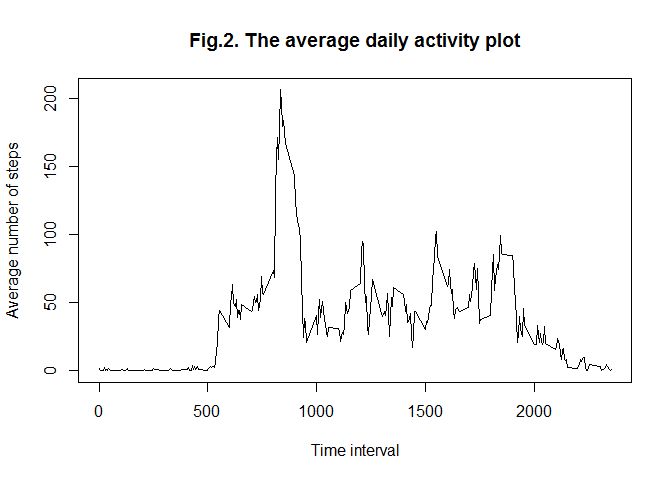
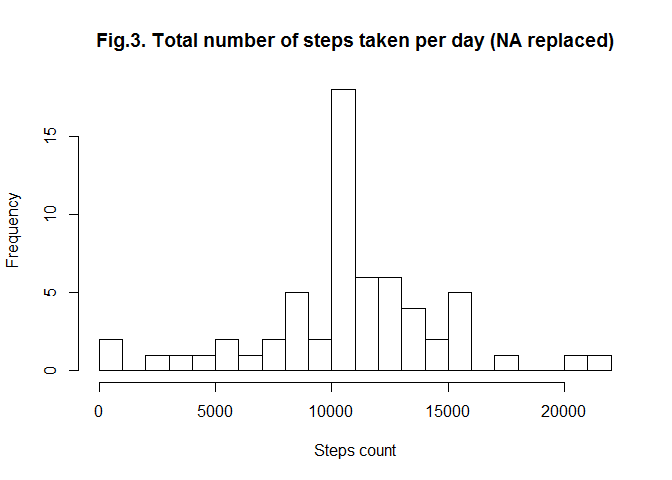
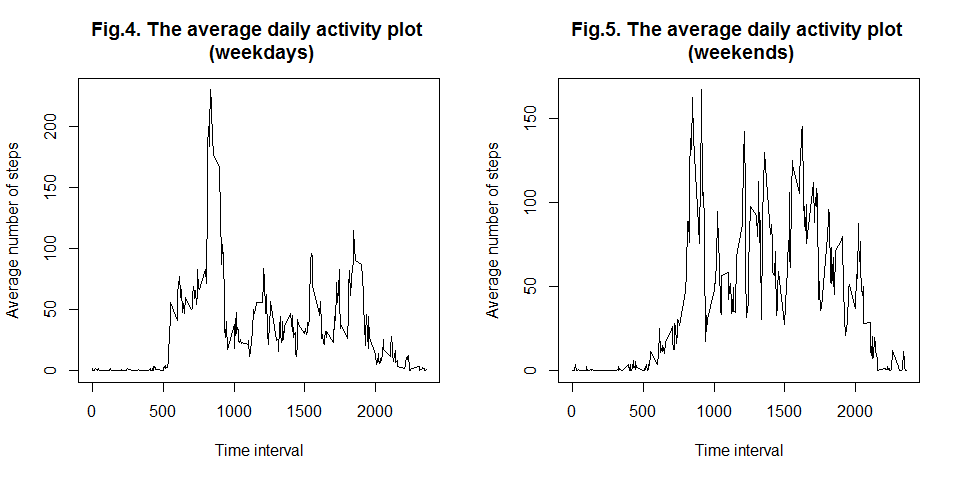

# Reproducible Research: Peer Assessment 1


## Loading and preprocessing the data
The first our step is loading data from the csv file.

```r
# working directory must be set on RepData_PeerAssessment1 folder on your computer

# unzip file
if (!file.exists('activity.csv')) {
    if (file.exists('activity.zip')) unzip('activity.zip')
    else stop('Data file is not found.')
}

# load data
df <- read.csv('activity.csv', stringsAsFactors = FALSE)
```

Now let's have a look at data.

```r
# look at data set fields
str(df)
```

```
## 'data.frame':	17568 obs. of  3 variables:
##  $ steps   : int  NA NA NA NA NA NA NA NA NA NA ...
##  $ date    : chr  "2012-10-01" "2012-10-01" "2012-10-01" "2012-10-01" ...
##  $ interval: int  0 5 10 15 20 25 30 35 40 45 ...
```

Data holds three variables which are according to Course Project instrictions:

- *steps*: integer type, number of steps taking in a 5-minute interval.

- *date*: character type, the date on which the measurement was taken in YYYY-MM-DD format.

- *interval*: integer type, identifier for the 5-minute interval in which measurement was taken.

Intervals are coded in hours and minutes pattern. The last two digits correspond to minutes of the hour, first two digits correspond to hour value. For example: interval **50** means **0 hour 50 minutes**, interval **1530** means **15 hours 30 minutes**.

## What is mean total number of steps taken per day?
Figure 1 shows a histogram of total number of steps taken per day (the missing values are ignored). We can see two peaks at the very begining and in the middle of the x scale. The first peak can be linked to the days with no observations.

```r
library(dplyr, warn.conflicts = FALSE)
# calculate total number of steps by day
steps_by_day <- select(df, steps, date) %>% group_by(date) %>% 
    summarise(total = sum(steps, na.rm = TRUE))
# build a histogram
hist(steps_by_day$total, breaks = 20, main = 'Fig.1. Total number of steps taken per day', 
     xlab = 'Steps count')
```

 

```r
# mean and median of the total number of steps taken per day
mn <- mean(steps_by_day$total)
mn
```

```
## [1] 9354.23
```

```r
med <- median(steps_by_day$total)
med
```

```
## [1] 10395
```

The mean of total number of steps taken per day is **9354.23**, the median is **10395**.

## What is the average daily activity pattern?
The average daily activity plot is presented on the figure 2 (the missing values are ignored). It shows the average number of steps in each time interval across all days.

```r
# calculate average number of steps taken by 5-minute interval
steps_by_int <- select(df, steps, interval) %>% group_by(interval) %>% 
    summarise(average = mean(steps, na.rm = TRUE))
# Make a time series plot
plot(average ~ interval, data = steps_by_int, type = "l", xlab = 'Time interval', 
     ylab = 'Average number of steps', main = 'Fig.2. The average daily activity plot')
```

 

```r
max(steps_by_int$average)
```

```
## [1] 206.1698
```

```r
with(steps_by_int, interval[which.max(average)])
```

```
## [1] 835
```

The maximum average activity equals to **206.17** steps and is registered at the interval **835**.

## Imputing missing values

```r
# count NA's in every variable
apply(df, 2, FUN=function(x) {sum(is.na(x))})
```

```
##    steps     date interval 
##     2304        0        0
```

Only  the *steps* variable has 2304 missing values or 'Not Available' data. The presence of missing observations may introduce bias into some calculations or summaries of the data. We should exclude this bias by replacing them with some data.

I think daily activity pattern is most significant result of this data set processing. So I use previously calculated average number of steps taken on the interval to fill missing data in a new data set.


```r
# copy dataset
df2 <- df
# vector of NA's to proceed
v <- which(is.na(df2$steps))
# replace NA's with average steps in the given interval (in a new data set)
df2$steps[v] <- steps_by_int$average[match(df2$interval[v], steps_by_int$interval)]
```

Now we build a new histogram of the total number of steps taken each day (figure 3). Comparing to figure 1 we can see that removing missing values significantly changes plot.

```r
# calculate total number of steps by day
steps_by_day2 <- select(df2, steps, date) %>% group_by(date) %>% 
    summarise(total = sum(steps))
# build a histogram
hist(steps_by_day2$total, breaks = 20, xlab = 'Steps count', 
    main = 'Fig.3. Total number of steps taken per day (NA replaced)')
```

 

```r
# mean and median of the total number of steps taken per day
mn2 <- mean(steps_by_day2$total)
mn2
```

```
## [1] 10766.19
```

```r
med2 <- median(steps_by_day2$total)
med2
```

```
## [1] 10766.19
```

The mean of total number of steps taken per day is **10766.19**, the median is **10766.19**.

## Are there differences in activity patterns between weekdays and weekends?
Figures 4 and 5 shows the daily activity patterns for weekdays and weekends.

```r
# create a vector of weekend days (in russian locale)
weekend_v <- c('суббота', 'воскресенье')
# Create a new factor variable in the dataset with two levels - "weekday" and "weekend"
df2$wd <- weekdays(as.Date(df2$date))
df2$wd <- ifelse(df2$wd %in% weekend_v, 'weekend', 'weekday')
df2$wd <- factor(df2$wd)

# make plots of activity for weekdays and weekends
par(mfrow = c(1,2))
# create plot for weekdays
steps_by_int_wd <- filter(df2, wd == 'weekday') %>% select(steps, interval) %>% 
    group_by(interval) %>% summarise(average = mean(steps))
plot(average ~ interval, data = steps_by_int_wd, type = "l", xlab = 'Time interval', 
     ylab = 'Average number of steps', 
     main = 'Fig.4. The average daily activity plot \n (weekdays)')

# create plot for weekends
steps_by_int_we <- filter(df2, wd == 'weekend') %>% select(steps, interval) %>% 
    group_by(interval) %>% summarise(average = mean(steps))
plot(average ~ interval, data = steps_by_int_we, type = "l", xlab = 'Time interval', 
     ylab = 'Average number of steps', 
     main = 'Fig.5. The average daily activity plot \n (weekends)')
```

 

We see that weekend pattern moved to right (observed man starts and finishes his day later) and flatter than weekday pattern.
